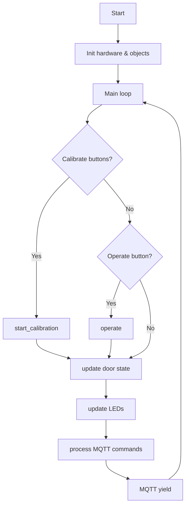
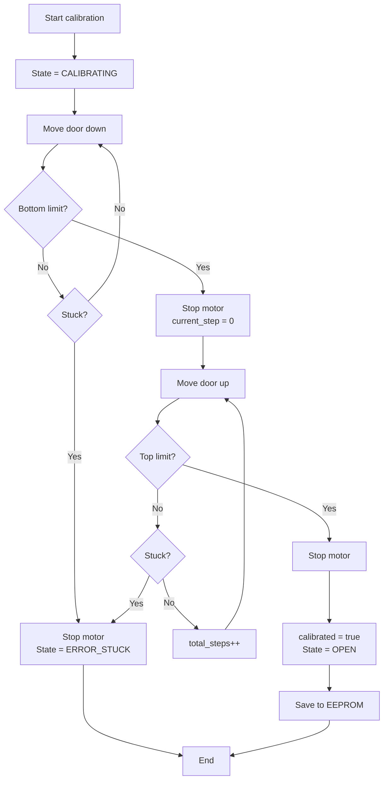
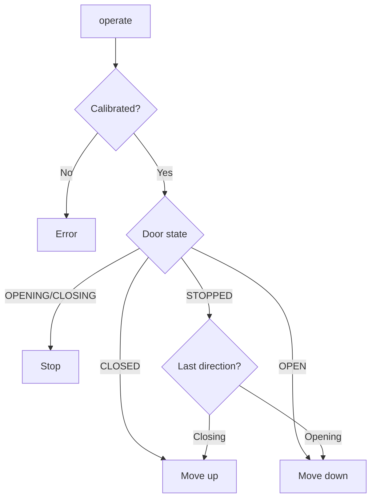

# Garage Door Controller – Embedded Software

## System Overview

The garage door controller is implemented using an object-oriented architecture.  
The system controls a stepper-motor driven garage door, supports automatic calibration, persistent state storage, and remote control via MQTT.

### Software Architecture
Main Loop  
   │  
   ├── GarageDoor (Core state machine)  
   │        │  
   │        ├── StepperMotor  
   │        ├── RotaryEncoder  
   │        └── PersistentState (EEPROM)  
   │  
   └── MqttController

---

## Features

- Automatic door calibration
- Stepper motor position control
- Rotary encoder feedback
- Persistent door state stored in EEPROM
- Remote control via MQTT
- Error detection if motor gets stuck
- LED status indication

---

## Important Notes
- **Never turn the stepper motor or move the belt by hand!**
- Door will not operate with either local buttons or remote commands if not calibrated
- If door gets stuck, it will require recalibration
  

### Hardware components:
- Raspberry Pi Pico W (RP2040)
- Step Motor 28BYJ-48 5V
- Crowtail I2C EEPROM v2.0
- Raspberry Pi Debug Probe

### GPIO Pins: 
- Stepper Motor Controller: GP2, GP3, GP6, GP13
- LED for status indication: GP20, GP21, GP22
- Buttons: SW0 (GP9), SW1 (GP8), SW2 (GP7)
- Limit Switches: Upper (GP28), Lower (GP27)
- Rotary Encoder: A (GP16), B (GP17)
- EEPROM: SDA (GP14), SCL (GP15)

---

## Build steps:

1. Clone the repository
2. Build the firmware
3. Flash to the microcontroller

---

## MQTT Interface

The controller exposes the following MQTT topics.

Command topic

garage/door/command

Commands

OPEN CLOSE STOP CALIBRATE

Status topic

garage/door/state

Possible states

OPEN CLOSED OPENING CLOSING STOPPED ERROR

---

## Flowcharts
The following flowcharts illustrate the main program flow, calibration process, and operate logic of the garage door controller. 
#### 1. Main Loop Flowchart

#### 2. Calibration Flowchart

#### 3. Operate Logic Flowchart

